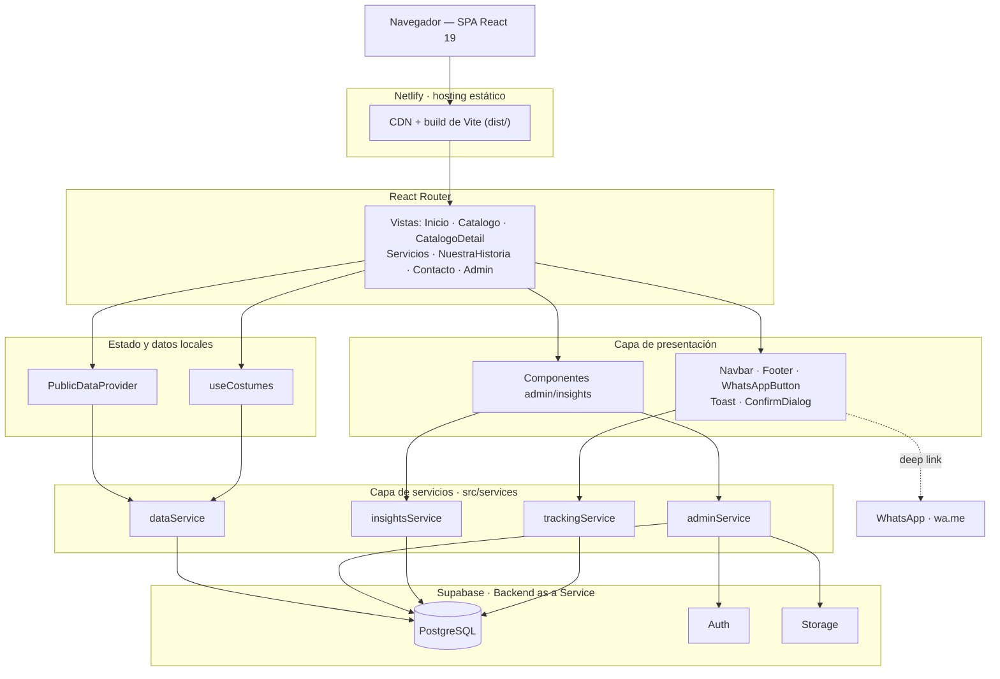
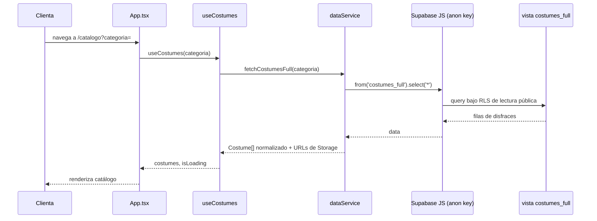
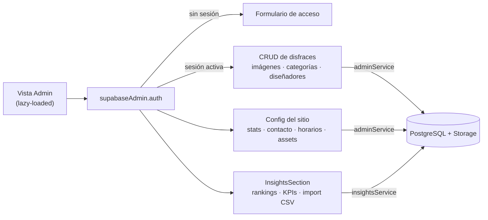
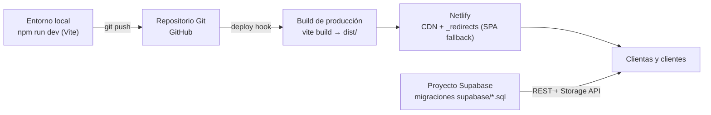

# Disfraces Madi

Disfraces Madi es una experiencia web elegante y artesanal para presentar el catálogo de disfraces de carnaval de Atelier Madi en Barranquilla, Colombia. La propuesta combina identidad local, diseño visual refinado y un flujo de conversión orientado a WhatsApp para consultas y agendamientos personalizados.

## ✨ Características

- Catálogo visual de disfraces con detalle por pieza (galería, tallas, telas, accesorios, diseñador)
- Precios de alquiler, venta y depósito reembolsable publicados en catálogo, ficha y formularios
- Funcionalidad de favoritos para guardar piezas de interés
- Diseño responsive y optimizado para móvil
- Botón flotante de WhatsApp como canal único de conversión, centrado en agendar cita
- Panel de administración (`/admin`, carga diferida) con CRUD de disfraces, imágenes, categorías y diseñadores
- Módulo de insights administrativos: rankings, KPIs, importación de histórico de alquileres vía CSV
- Identidad de marca cercana, festiva y profesional

## 🏗️ Arquitectura

Disfraces Madi es una SPA de React servida como sitio estático (build de Vite) sobre Netlify. No hay servidor de aplicación propio: toda la persistencia, autenticación de administración y almacenamiento de imágenes corren en **Supabase** (Postgres + Auth + Storage), consumidos directamente desde el navegador vía `@supabase/supabase-js`. El único sistema externo con el que conversa la interfaz pública es WhatsApp, como canal único de conversión.

### Capas del sistema



| Capa | Responsabilidad | Archivos clave |
|---|---|---|
| Rutas | Define las pantallas públicas y el panel admin (con carga diferida vía `lazy`). | `src/App.tsx` |
| Vistas | Una vista por pantalla; componen presentación, estado y servicios. | `src/views/*.tsx` |
| Presentación | Componentes reutilizables: navegación, feedback (Toast/ConfirmDialog), CTA de WhatsApp, widgets del dashboard de insights. | `src/components/` |
| Estado | Contexto público (stats, contacto, reseñas) y el hook de catálogo con filtro por categoría. | `src/context/PublicDataContext.tsx`, `src/hooks/useCostumes.ts` |
| Servicios | Único punto de contacto con Supabase: lectura pública, CRUD de administración, analítica de rankings/CSV y tracking de eventos. | `src/services/*.ts` |
| Cliente Supabase | Instancias del cliente (anon y admin) y resolución de URLs públicas de Storage. | `src/lib/supabase.ts` |

### Flujo de datos: catálogo público

Ejemplo de extremo a extremo — una clienta visita `/catalogo`.



- La vista `costumes_full` (definida en `supabase/003_views.sql`, extendida en `008_deposit_price.sql`) une `costumes` con categoría, diseñador, precios y disponibilidad en una sola fila lista para el catálogo.
- `dataService` normaliza `snake_case` → `camelCase` y resuelve las rutas de Storage a URLs públicas antes de entregar los datos a la vista.
- Si Supabase no está configurado (sin variables de entorno), los servicios públicos devuelven listas vacías o los valores de respaldo de `src/data.ts`, sin romper el render.

### Panel de administración

Cargado bajo demanda en `/admin`; concentra todo lo que no es público.



- `trackingService` registra vistas de ficha y clics de WhatsApp por disfraz (deduplicados por sesión) para alimentar los rankings de `InsightsSection`.
- La importación de histórico de alquileres (`CsvImportPanel.tsx`) usa `src/utils/csv.ts` y `src/utils/textMatch.ts` para sugerir el disfraz correspondiente a cada fila y guardar el alias para futuras cargas.
- Todo el feedback de UI (éxito, error, confirmaciones destructivas) pasa por `Toast` y `ConfirmDialog` — nunca `alert()`/`confirm()` nativos, por regla de `DESIGN.md`.

### Despliegue e infraestructura



- `public/_redirects` reescribe cualquier ruta a `index.html` (200) para que React Router resuelva el path en el cliente.
- El esquema de Supabase vive versionado como SQL plano en `supabase/001` … `010`: tablas base, vistas (`costumes_full`), RLS pública y de admin, buckets de Storage, precio de depósito, eventos de tracking e histórico de alquileres.
- `express`, `dotenv` y `@google/genai` están declarados como dependencias auxiliares (ver `AGENTS.md`) pero no están cableados en `src/` hoy: no hay servidor propio en producción.

## 🛠️ Stack tecnológico

| Área | Tecnología |
|---|---|
| Frontend | React 19 + TypeScript 5.8 sobre Vite 6, con React Router 7 para el ruteo de la SPA |
| Estilos | Tailwind CSS 4 vía plugin oficial de Vite, siguiendo la paleta y tipografía de `DESIGN.md` |
| UI & animación | `lucide-react` / `react-icons` para iconografía y `motion` (`motion/react`) para transiciones de vista |
| Backend | Supabase: PostgreSQL con RLS, Auth para la sesión de administración y Storage para imágenes de catálogo y assets del sitio |
| Hosting | Netlify sirve el build estático de `dist/` con fallback de SPA vía `_redirects` |
| Conversión | Botón flotante de WhatsApp como único canal de contacto, centrado en agendar cita para probarse un disfraz |
| Auxiliares | `express`, `dotenv`, `@google/genai` — declarados como dependencias de soporte, no cableados en `src/` en producción |

## 🚀 Inicio rápido

### Requisitos

- Node.js 20 o superior
- npm 10 o superior
- Un proyecto de Supabase (opcional para desarrollo local; sin variables de entorno, la app cae a los datos de respaldo en `src/data.ts`)

### Instalación

```bash
npm install
```

### Variables de entorno

Copia `.env.example` a `.env` y completa las credenciales del proyecto de Supabase:

```bash
# Supabase configuration
VITE_SUPABASE_URL=https://your-project-ref.supabase.co
VITE_SUPABASE_ANON_KEY=your-anon-key
```

Para la configuración completa del backend (Dashboard, Auth, buckets, políticas, verificación y rollback) consulta [`docs/SUPABASE_SETUP.md`](docs/SUPABASE_SETUP.md).

### Ejecutar localmente

```bash
npm run dev
```

La aplicación quedará disponible en http://localhost:3000.

### Scripts disponibles

| Comando | Descripción |
|---|---|
| `npm run dev` | Servidor de desarrollo con Vite (puerto 3000). |
| `npm run build` | Build de producción (`vite build` → `dist/`). |
| `npm run preview` | Sirve localmente el build de producción para verificarlo. |
| `npm run lint` | Chequeo de tipos con TypeScript (`tsc --noEmit`), sin emitir archivos. |
| `npm run clean` | Elimina `dist/` y `server.js`. |

## 📁 Estructura del proyecto

```text
src/
  App.tsx              Enrutamiento raíz (React Router) y layout general
  components/           Componentes reutilizables (Navbar, Footer, WhatsAppButton, Toast, ConfirmDialog...)
    admin/insights/      Widgets del dashboard de insights (KPIs, rankings, importación CSV)
  views/                 Vistas por pantalla: Inicio, Catalogo, CatalogoDetail, Servicios,
                          NuestraHistoria, Contacto, NotFound, Admin (lazy-loaded)
    admin/                InsightsSection.tsx: analítica del panel de administración
  context/               PublicDataContext: stats, contacto y reseñas para consumo público
  hooks/                 useCostumes: catálogo con filtro por categoría
  services/              Único punto de contacto con Supabase (dataService, adminService,
                          insightsService, trackingService)
  lib/                   Cliente Supabase (instancias anon/admin) y resolución de URLs de Storage
  utils/                 Utilidades: formato, rangos de fecha, parsing de CSV, matching de texto
  data.ts                Datos de catálogo/contacto de respaldo cuando Supabase no está configurado
  types.ts               Tipos TypeScript del proyecto (Costume, Booking, Inquiry, Review...)

supabase/
  001_init.sql … 010_rental_history.sql   Migraciones versionadas (esquema, vistas, RLS, Storage,
                                            depósito, tracking, histórico de alquileres)
  README.md                                Guía de migraciones y orden de ejecución

docs/
  SUPABASE_SETUP.md      Guía completa de configuración del backend
  specs/                  Specs de producto: specs_backlog, specs_done, specs_freeze
  prompts/                Prompts de referencia para automatizaciones

public/
  _redirects              Fallback de SPA para Netlify (200 → index.html)
```

## 🗄️ Modelo de datos y backend

El esquema vive versionado como SQL plano en `supabase/`, aplicado en orden numérico estricto (`001` → `010`):

1. **`001_init.sql`** — esquema base y constraints.
2. **`002_seed.sql`** — datos iniciales del catálogo.
3. **`003_views.sql`** — vista `costumes_full` y trigger de rating/reviews.
4. **`004_rls.sql`** — Row Level Security de lectura pública.
5. **`005_admin_auth.sql`** — modelo de autorización admin (`admin_users` + `is_admin()`).
6. **`006_admin_rls.sql`** — políticas INSERT/UPDATE/DELETE exclusivas para admins.
7. **`007_storage_admin.sql`** — buckets y políticas de Storage para assets administrados.
8. **`008_deposit_price.sql`** — columna `deposit_price` en `costumes` y actualización de `costumes_full`.
9. **`009_costume_events.sql`** — tabla `costume_events` (tracking anónimo de vistas de ficha y clics de WhatsApp), INSERT abierto a `anon`, SELECT restringido a admin.
10. **`010_rental_history.sql`** — tablas `costume_rental_history` (histórico importado del CSV digitalizado) y `costume_label_aliases` (vinculación reutilizable de etiquetas), ambas admin-only.

## 📐 Reglas de negocio y diseño

Este proyecto sigue reglas de negocio y de sistema de diseño estrictas, documentadas y de cumplimiento obligatorio para cualquier cambio:

- **[`AGENTS.md`](AGENTS.md)** — reglas de negocio (publicación de precios, restricciones sobre ubicación, flujo de WhatsApp), convenciones de versionado/changelog y flujo de trabajo por specs.
- **[`DESIGN.md`](DESIGN.md)** — sistema de diseño: paleta cromática, tipografía e iconografía.

## 📄 Licencia

Este proyecto se distribuye bajo la licencia MIT.

## 📬 Contacto

Para consultas o agendamientos, el canal principal de conversión es WhatsApp, disponible como botón flotante en todas las pantallas del sitio.
